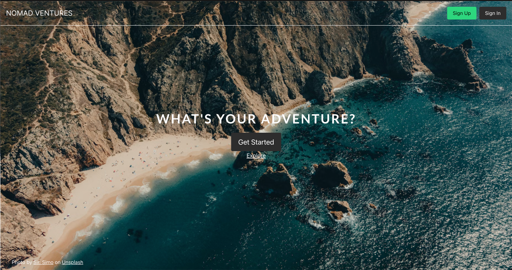

# Nomad-Ventures

A full stack web application for travelers who want to blog about their adventures.

---

## Purpose of this Project

As an avid traveler and someone who loves a good adventure I have always wished that there was a better way to share my traveling stories with the world. I love being able to learn about other people's adventures to give me inspiration on where I want to travel to in the future. I created this website to be a unique experience of being able to share life stories from places all over the world.

### 🔗 Live Deployment

Try the application out here: https://nomad-ventures.silvatim.com/

---

## 💻 Technologies Used


### APIs

- Unsplash API: https://unsplash.com/documentation

---

## 📝 Features

- User can sign up for an account
- User can log in to their account
- User can create a blog post
- User can edit a blog post
- User can delete a blog post
- User can see all their previous blog posts (profile page)
- User can see other people's blog posts
- User can use the Unsplash API to add a photo to their blog posts

---

## 👀 Preview

#### Home Page



#### Walkthrough Various Features


---

## 🔮 Future Features

- User can like blog posts
- User can save blog posts

---

## 👨‍💻 Development

1. Clone the repository.

   ```shell
   git clone https://github.com/silva-tim/nomad-ventures.git
   ```

1. Install all dependencies with NPM.

   ```shell
   npm install
   ```

1. Start PostgreSQL

   ```sh
   sudo service postgresql start
   ```

1. Create database (replace `name-of-database` with a name of your choosing)

   ```sh
   createdb name-of-database
   ```

1. In the `server/.env` file, in the `DATABASE_URL` value, replace `changeMe` with the name of your database, from the last step

1. Start the project. Once started you can view the application by opening http://localhost:3000 in your browser.

   ```shell
   npm run dev
   ```
